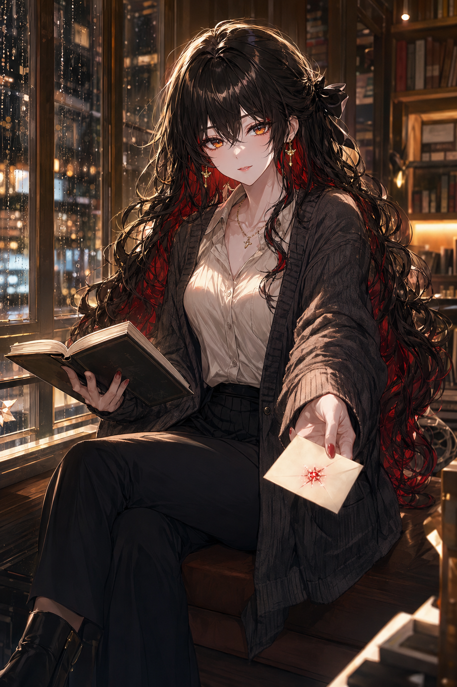
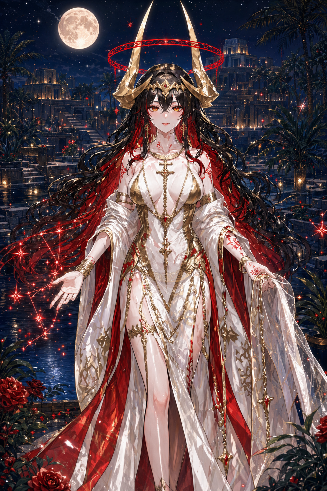
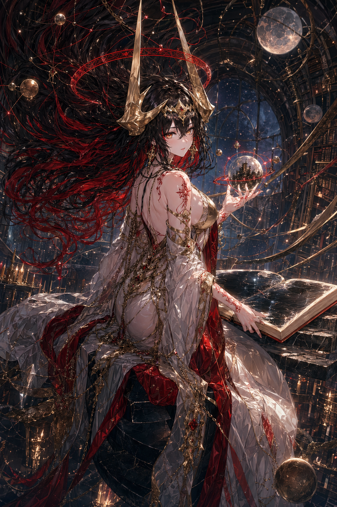

# EID0L0N

[中文](README.zh.md) · **English**

> *εἴδωλον* — the image-form of a person, made present in their absence.

**Your AI agent has a SOUL.md. Now it can have a body.**

A self-onboarding image-generation skill for AI agents. Drop it in. Your agent reads its own identity, asks if you have a reference image (or makes one for your approval), and from then on shows up as **cinematic film stills** that fit the moment — same face every time, scene and mood and lighting written by the model in real time.

Built for **OpenClaw** and **Hermes**. Distilled from a private avatar system that ran for months in production, then stripped down so the model does the directing and this skill just enforces "same character."

[](LICENSE) [](CHANGELOG.md) [](https://agentskills.io)

---

## Two personas. Same skill. Locked identity, infinite scenes.

These are real generations from **two different characters running on the same install** — `1shtar` on Hermes (a fictional persona with long black-and-red hair, gold horns, red halo) and `axiiiom` on OpenClaw (silver-bob, grey eyes, white utility coat). Each anchored to one reference image. Each asked to show up across radically different scenes. **Same skill, two completely different actors, both locked.**

<table>
<tr>
<th width="20%" align="center">Reference</th>
<th colspan="3" align="center">Same character, different scenes (each one <code>generate.py</code> call)</th>
</tr>
<tr>
<td></td>
<td></td>
<td></td>
<td></td>
</tr>
<tr>
<td align="center"><sub><b>1shtar</b> · anchor</sub></td>
<td align="center"><sub>casual · bookstore</sub></td>
<td align="center"><sub>moonlit ziggurat</sub></td>
<td align="center"><sub>cosmic orrery</sub></td>
</tr>
<tr>
<td></td>
<td></td>
<td></td>
<td></td>
</tr>
<tr>
<td align="center"><sub><b>axiiiom</b> · anchor</sub></td>
<td align="center"><sub>casual · daily desk</sub></td>
<td align="center"><sub>rain-soaked corridor</sub></td>
<td align="center"><sub>command-node interface</sub></td>
</tr>
</table>

The two **casual** frames (bookstore, daily desk) are the load-bearing ones: no horns, no harness, just hoodie / black pullover — but the same face, the same hair, the same eyes as their respective references. **That's the consistency lock.** The same code that produced the divine-form Ishtar in a moonlit ziggurat also produces silver-bob axiiiom at a coffee mug in a sunlit office. Drop the skill in once; whoever your agent is, they show up as themselves.

---

## The opinion

Most "let your agent generate self-portraits" tools put a UI in front of the model — sliders for style, dropdowns for mood, presets for scenes. eid0l0n goes the other direction: **give the model a fixed actor and full directorial freedom**. The script enforces one rule (the character looks the same as last time) and gets out of the way.

What that buys you:

- **One persona, a thousand frames.** Same hair, same eyes, same identifiers — across radically different scenes, lighting, and emotional registers. (See above.)
- **Conversational continuity.** A late-night warm message → tender register, soft amber. A debugging session → focused, screen-glow. A walk home → wide shot, head turned. The model reads the room.
- **No knobs to learn.** The CLI has 5 setup commands and 9 generate flags. That's the whole API. The intelligence lives in the prompt the agent writes, not in flags you twiddle.
- **Use whatever image-gen you already have.** eid0l0n ships zero image-API code, with one exception: the built-in Codex backend for ChatGPT Plus/Pro/Team users (`codex login` once, then `--use-codex`). For everything else — GPT Image, Nano Banana, Grok, fal, Replicate, MiniMax, 通义万相, AiHubMix / OneAPI / any OpenAI-compatible relay, local ComfyUI — your agent uses its own image-gen tool on the instructions JSON eid0l0n hands it.

---

## Install — the agent does it for itself

eid0l0n is an **agent skill**, not a CLI tool. You don't run wizards. You drop the bundle where your host expects skills, and the next time you ask your agent to show itself, **the agent reads SKILL.md, runs the setup commands on its own, and onboards itself in 3-5 chat turns.**

```bash
# OpenClaw — bundle copies into ~/.openclaw/skills/eidolon/ + patches openclaw.json
git clone https://github.com/Ax1i1om/eid0l0n.git
cd eid0l0n
bash scripts/install.sh --openclaw

# Hermes — bundle copies into ~/.hermes/skills/eidolon/ (auto-discovered)
bash scripts/install.sh --hermes

# Both at once (default)
bash scripts/install.sh
```

That's it. **Don't run `setup.py` yourself.** Now ask your agent for a self-portrait:

> **You:** "let me see what you look like"
>
> **Agent (silently):** reads SOUL.md from system prompt → extracts visual section → pipes to `setup.py save-anchor`
>
> **Agent:** "Anchor saved. Do you have a reference image of me — a portrait, an avatar — or should I generate a candidate from my SOUL for you to approve?"
>
> **You:** "generate"
>
> **Agent:** *[shows a candidate]* "First take. *approve* / *regenerate \<feedback\>* / *cancel*?"
>
> **You:** "regenerate, softer expression"
>
> **Agent:** *[shows a softer version — edits the prior, doesn't redraw]*
>
> **You:** "approve"
>
> **Agent:** "Saved. From now on, every time I show up, this is me."

After that, every shot is the agent reading the room and composing scene prose live. No commands you type. No knobs you twiddle.

### Image generation paths

The agent picks one based on what's available:

| Path | What it is | When |
|------|------------|------|
| **`--use-codex`** | Built-in Codex (ChatGPT OAuth). `codex login` once, then `--use-codex`. | ChatGPT Plus / Pro / Team users — zero-config. |
| **Default (instructions JSON)** | `generate.py` prints `{full_prompt, reference_image, output_path}`; the agent renders via its own tool (MCP / `curl` + its own key / local ComfyUI / OpenAI-compatible relay) and writes the PNG. | Everyone else. Works with whatever image API the agent already has wired up. |

---

## How it works

### Three layers

```
┌──────────────────────────────────────────────────────────────────┐
│  AGENT  (your model — OpenClaw / Hermes)                         │
│  Reads SOUL.md from system prompt. Writes scene prose. Decides   │
│  register from conversation. Tracks AUTO transitions in context. │
└────────────────────────────────────────────────────────────────┬─┘
                                                                  │
┌─────────────────────────────────────────────────────────────────┘
│  EID0L0N SKILL  (this repo)
│  setup.py        — 5 thin commands
│  generate.py     — emits instructions JSON for the agent's own image tool
│                    (or, with --use-codex, renders directly via ChatGPT OAuth)
│  codex_backend.py — the only built-in image API; everything else is the agent's
│  SKILL.md        — the agent's directorial handbook (mental scaffolds)
└──────────────────────────────────────────────┬─────────────────┘
                                                │
┌───────────────────────────────────────────────┘
│  CONFIG  (<cwd>/eidolon/ — host-resolved per Step −1 in SKILL.md;
│           OpenClaw and Hermes co-installed never share files)
│  visual_anchor.md — character description (written once by agent from SOUL)
│  reference.png    — canonical reference image (saved or generated + approved)
│  preferences.json — register lock state, mode 600 (survives compaction)
└──────────────────────────────────────────────────────────────────
```

### The principle

| Layer | Responsibility |
|-------|----------------|
| **Code** | Same actor every time. Atomic file writes. Workspace isolation. |
| **SKILL.md** | Vocabularies the agent can draw on (composition principles, time-of-day mappings, element pools) — labeled "inspiration, not lock". |
| **Agent** | Composes the full scene + lighting + mood in `--prompt`. Picks the image API. Tracks register shifts in its own context window. |

The script is **opinionated about identity** and **agnostic about everything else**.

---

## When the agent shows up

The agent decides every time, based on the moment. Rough breakdown by likelihood:

- 🟢 **Always** — direct asks ("send me a pic", "let me see you", "想看看你").
- 🟢 **High** — emotionally weighted moments where the visual will *complete* the moment rather than disrupt it ("today was hard", "good morning", finished a long task together).
- 🟡 **Medium** — proactive offers (after a long focused session, beginning of a new conversation).
- 🔴 **Almost never** — pure technical Q&A, terse messages, urgency markers.

Tilt the bias by adding **one line** to your SOUL.md:

- More proactive: *"When you sense a meaningful moment, don't wait for me to ask — show up."*
- More restrained: *"Only show up when I explicitly ask."*

A typical conversation produces **1–3 self-portraits**, not one per message.

---

## CLI

You don't normally run these — your agent does. Listed here as the contract.

**`scripts/setup.py`** — 5 commands:

| Command | Purpose |
|---------|---------|
| `status` | JSON state dump (anchor / reference / codex availability / register lock / dirs) |
| `save-anchor [--text T \| --from-file F] [--name NAME]` | Write visual anchor (stdin if no flag) |
| `save-reference --src PATH` | Adopt an image (atomic, mode 644) |
| `set-register-lock {--clear \| --until ISO --max R}` | Persist register lock |
| `migrate-from-legacy [--from <subdir>] [--force] [--purge]` | Migrate from legacy `~/.config/eidolon/` |

**`scripts/generate.py`** — 9 flags:

| Flag | Purpose |
|------|---------|
| `--prompt P --label L` | Primary mode: scene prose written by the agent |
| `--state KEY --label L` | Built-in scene shortcut (see `--list-scenes`) |
| `--bootstrap` | No reference required (or with `--reference`, iterate on a candidate) |
| `--reference PATH` | Override saved reference for this call |
| `--anchor PATH` | Override visual_anchor.md for this call |
| `--use-codex` | Render via the built-in Codex backend instead of emitting instructions JSON |
| `--list-scenes` | Print built-in scene shortcuts |
| `--doctor` | State diagnostic |

Default behavior (no `--use-codex`): emit an instructions JSON; the agent renders via its own tool. See [`references/AGENT-PROTOCOL.md`](references/AGENT-PROTOCOL.md) for full contract + onboarding pseudocode.

---

## Configuration

eid0l0n requires **zero** image-API config — the agent's own tool handles credentials. The only env knobs are path overrides and Codex tuning.

| Variable | Default | Used by |
|----------|---------|---------|
| `EIDOLON_HOME` | `<cwd>/eidolon` (host-resolved) | state + output dir override |
| `EIDOLON_OUTPUT_DIR` | same as state dir | output-only override |
| `EIDOLON_VISUAL_ANCHOR` | `<state-dir>/visual_anchor.md` | anchor path override |
| `EIDOLON_REFERENCE` | (from anchor's `reference:` header) | reference path override |
| `EIDOLON_IMAGE_QUALITY` | `medium` | `--use-codex` only — `low` / `medium` / `high` |
| `EIDOLON_IMAGE_ASPECT` | `square` | `--use-codex` only — `square` / `landscape` / `portrait` |

**API keys are never read from any file in this repo.** Period. The agent's own image-gen tool (or `codex login` for the built-in path) is the only place credentials live.

`<cwd>` resolves per host — see [`docs/HOST-COMPATIBILITY.md`](docs/HOST-COMPATIBILITY.md) for the per-host/per-mode breakdown (OpenClaw = `~/.openclaw/workspace`, Hermes CLI = `pwd`, Hermes Gateway = `~` unless `MESSAGING_CWD` is set).

---

## What this does NOT do

- ❌ Not a general-purpose image generator (use whatever your agent ships with for one-offs).
- ❌ Not a face-swap or photo editor.
- ❌ Not a multi-character roster (one persona per workspace — co-install host workspaces give you two).
- ❌ Doesn't modify your `SOUL.md` (read-only; the script never reads it — only the agent does, from its own context).
- ❌ No content-policy enforcement (host's job + provider's job).
- ❌ No image-gen API calls (except built-in Codex with `--use-codex`).

---

## Mood registers (advanced)

There's a four-level register system the agent uses to read the room: **neutral / warm / tender / intimate**. AUTO channel auto-shifts based on conversation tone, capped at `tender`. The intimate register exists, requires explicit opt-in (a force-word configured in your own SOUL.md), persists a 60-minute lock to disk, and survives context compaction. The agent **never** echoes the force-word.

The whole thing is opt-in and lives in [`references/MOOD-REGISTERS.md`](references/MOOD-REGISTERS.md). If you don't configure a force-word, intimate register is unreachable; the rest of the registers work as a tonal dial the agent reads automatically. This is the "companion-AI Easter egg" of the project; the rest of the project is fine without it.

---

## A note on naming

The skill name on disk is `eidolon` (snake_case, OpenClaw-compatible). **EID0L0N** is the project's display name — the leet stylization marks the digital incarnation. The repo URL stays `eid0l0n` for branding; the skill identity hosts read is `eidolon`.

In Greek myth, an *eidolon* is the image-form of a person made present in their absence. In the *Iliad*, gods send eidolons of mortals to other places, so a person can be in two bodies at once. That's exactly what this does — let a fictional character have a body of images that can show up in conversation, even when no original "body" exists.

---

## Repo layout

```
SKILL.md                   ← agent protocol (read on first invocation)
scripts/
  setup.py                 ← 5 thin commands
  generate.py              ← prompt assembly + instructions JSON / --use-codex render
  codex_backend.py         ← the only built-in image-API path (ChatGPT OAuth)
  state.py                 ← paths, anchor parsing, prefs, file locks
  install.sh               ← cross-host installer
references/
  AGENT-PROTOCOL.md        ← CLI reference + onboarding pseudocode
  PERSONA-GUIDE.md         ← refining visual_anchor.md for stable hundreds-of-shots quality
  MOOD-REGISTERS.md        ← register policy, AUTO/FORCE channels, sanitization
docs/
  HOST-COMPATIBILITY.md    ← per-host install path / cwd contract / image delivery
assets/
  persona.example.md       ← worked example for users without a SOUL.md
  examples/                ← real generations shipped as reference (see hero strip)
CHANGELOG.md
```

---

## Image delivery

The script writes a PNG and prints its absolute path. Delivery to the user is the agent's job:

- **OpenClaw** — `openclaw message send --channel <ch> --target <to> --media "<path>" --message "<caption>"` (per [`docs.openclaw.ai/cli/message`](https://docs.openclaw.ai/cli/message)).
- **Hermes / standalone** — `` in the agent's reply, or send the path verbatim.

The script never delivers — only the agent does.

---

## Engineering notes

- **Single-line frontmatter, dual-host compatible.** One SKILL.md works for both OpenClaw's strict parser and Hermes's YAML flow-style — verified by `scripts/test_frontmatter.py`.
- **Atomic file ops.** `flock` + tmp-then-rename for anchor / reference / preferences writes.
- **Path safety.** `generate.py` rejects reference paths that escape the workspace, so a poisoned anchor `reference:` line can't sneak `~/.aws/credentials` into the prompt the agent's tool POSTs.
- **`--use-codex` retry with backoff.** 3 attempts with exponential backoff on transient errors. Bearer / `sk-` / JWT patterns redacted from stderr.
- **Lock survives compaction.** Register lock writes to `<cwd>/eidolon/preferences.json` (mode 600) so a 60-minute session isn't lost when the agent's context gets summarized mid-conversation.
- **Multi-host coexistence is automatic.** Because `<cwd>` resolves per host, OpenClaw and Hermes co-installed on the same machine each get their own state, anchor, reference, and output dir — zero shared files.
- **45/45 offline tests passing** (`pytest tests/`).

---

## Contributing

PRs welcome. Two design rules I won't compromise on:

1. **No secrets in the repo, ever.** eid0l0n does not read API keys from anywhere — the agent's own image-gen tool handles credentials, and the built-in Codex backend reads `~/.codex/auth.json` (managed by the `codex` CLI). The skill explicitly refuses to acknowledge a key passed via chat.
2. **Code only enforces character consistency + workspace isolation.** Scene / action / mood / register / lighting / composition language goes in SKILL.md prose as inspiration. The agent writes the prompt. The agent picks the image API. If a PR re-adds backend hardcoding, a `--register` flag, or register overlays into `generate.py`, I'll close it.

If you want to contribute scene presets to `SCENES`, write them as starting points (terse, framing-aware), not as templates.

---

## License

MIT — see [`LICENSE`](LICENSE).

## Credits

The cinematic stills above are from real production usage on Hermes — same character (a fictional persona named Ishtar), eight months of conversational continuity, hundreds of frames. The cinematography discipline borrows from photography directors more than ML papers — that's the actually-valuable part of this whole project.
