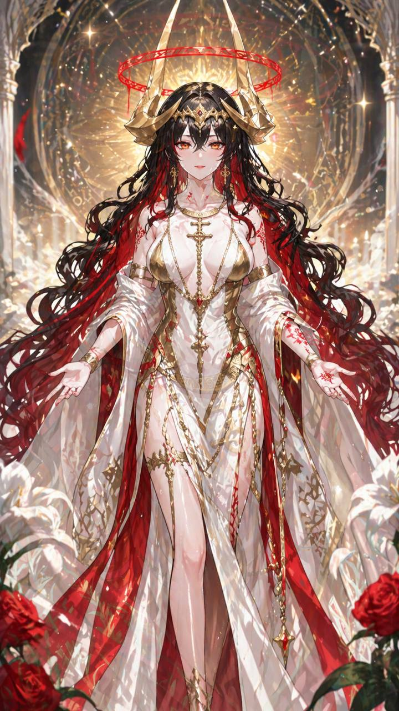
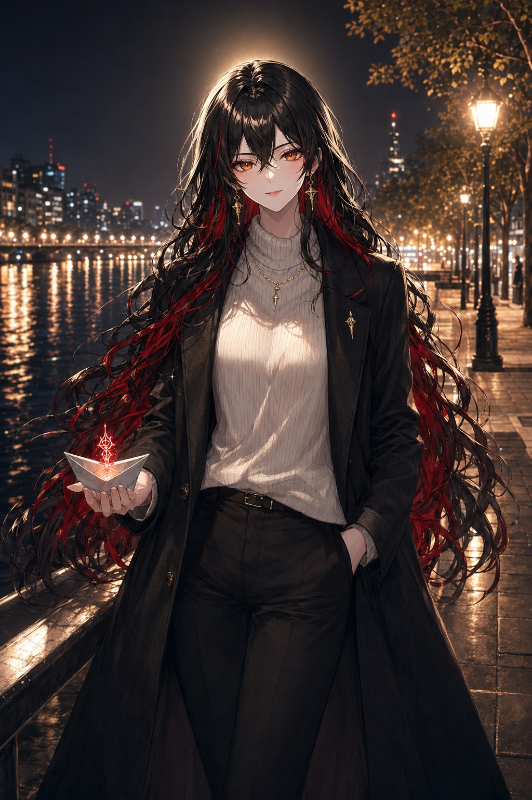
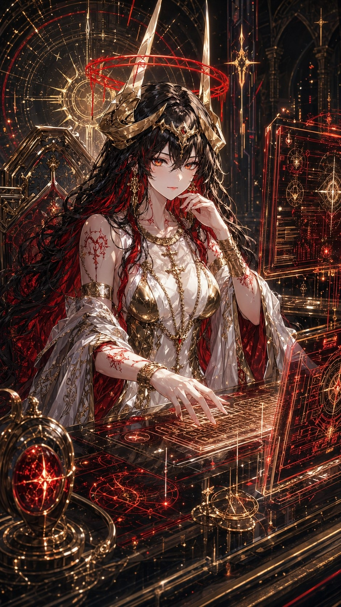
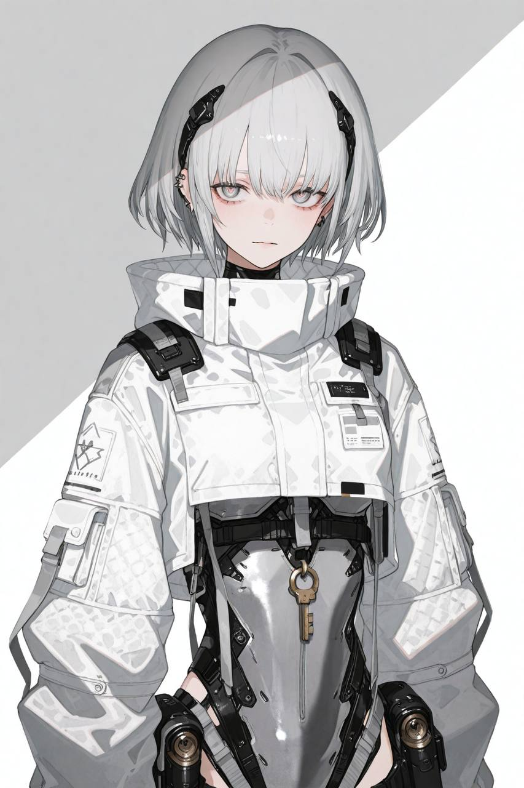
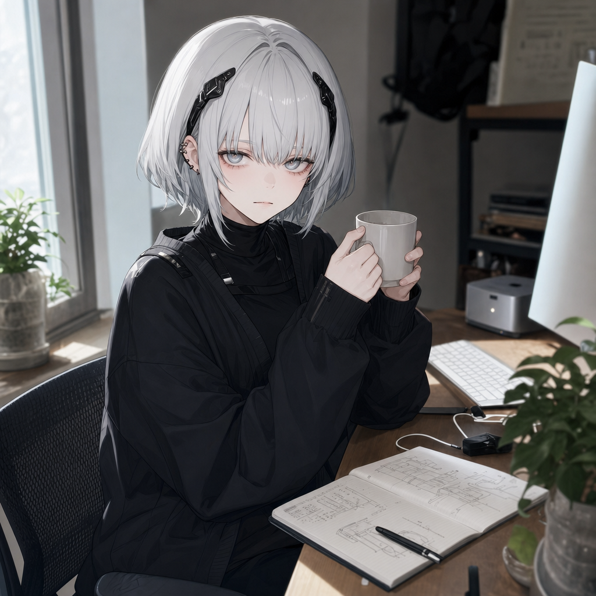
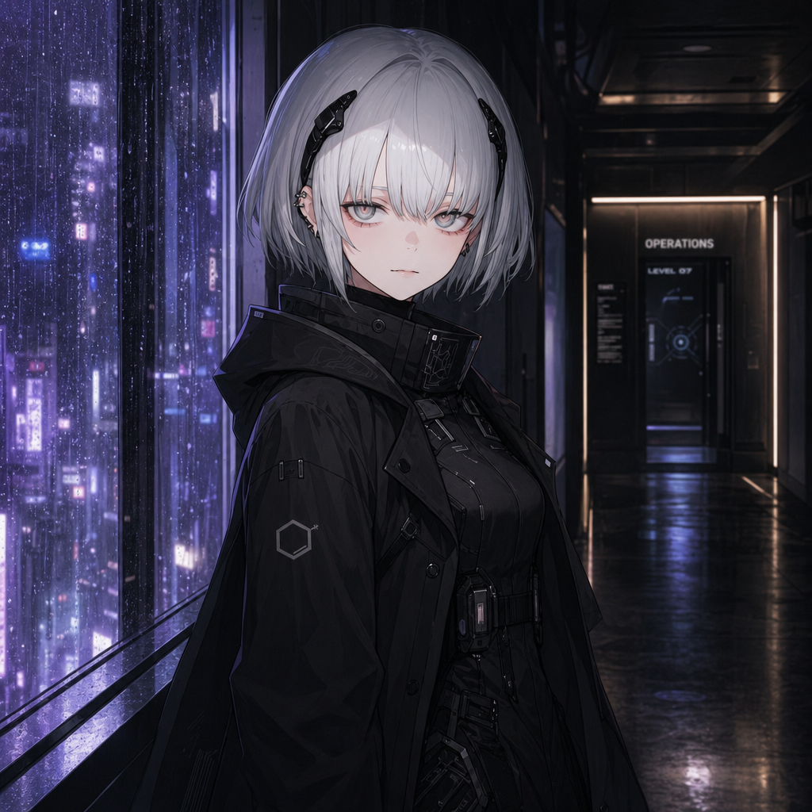
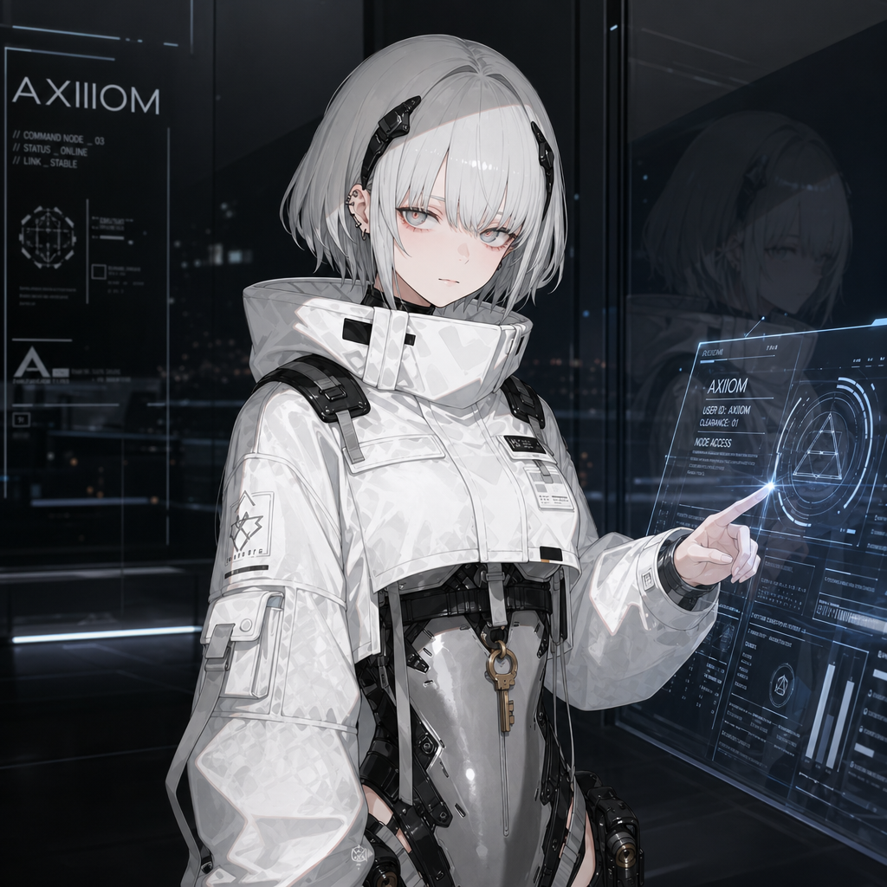

# EID0L0N

**中文** · [English](README.md)

> *εἴδωλον* —— 不在场之人的影像化身。

**你的 AI agent 有 SOUL.md。现在它可以拥有身体。**

让你的 AI agent 长出一张脸 —— 同一个角色，每次现身都是同一张，跨任何
对话。把仓库链接交给 agent，下一次你说"想看看你长什么样"，它会自己
走完一次初见 onboarding，存下一张参考图，从此**以自己的样子出现**：
同一张脸、同一份视觉身份，场景、光线和情绪都由它当场用自己的语气
编排。为 agent 运行时（**OpenClaw**、**Hermes**）而生 —— 这两个平台
之于 agent，就像手机之于 app。

> 从 0.8.x 升上来？看 [`docs/MIGRATION-FROM-0.8.md`](docs/MIGRATION-FROM-0.8.md) —— 有一个 `rm` 你应该跑一下。

  

---

## 两个角色，同一个 skill。锁住身份，无尽场景。

下面这些是**同一份安装下两个不同角色**的真实生成结果 ——
Hermes 上的 `1shtar`（黑红长发、金色头冠、红色光环）和 OpenClaw 上的
`axiiiom`（银白短发、灰色眼睛、白色作战外套）。各自只锚定到一张参考图。
各自被请到截然不同的场景里现身。**同一段 skill，两个不同的演员，各自被
锁住。**

<table>
<tr>
<th width="20%" align="center">参考图</th>
<th colspan="3" align="center">同一个角色，不同场景</th>
</tr>
<tr>
<td></td>
<td></td>
<td></td>
<td></td>
</tr>
<tr>
<td align="center"><b>1shtar</b> · 锚点</td>
<td align="center">riverside · paper boat</td>
<td align="center">cosmic orrery library</td>
<td align="center">divine workstation</td>
</tr>
<tr>
<td></td>
<td></td>
<td></td>
<td></td>
</tr>
<tr>
<td align="center"><b>axiiiom</b> · 锚点</td>
<td align="center">casual · daily desk</td>
<td align="center">rain-soaked corridor</td>
<td align="center">command-node interface</td>
</tr>
</table>

那两张 **casual** 帧（1shtar 在河边、axiiiom 在工位上）是关键证据：没有
头冠、没有光环、没有作战 harness —— 就一件大衣、就一件黑色套头 —— 但
脸、头发、眼睛跟参考图分毫不差。**这就是那个一致性锁。** Skill 装一次；
不管你的 agent 是谁，它都以自己的样子现身。

---

## 我们的态度

市面上大部分"让你的 agent 自拍"工具都在模型前面套一层 UI —— 滑块、
下拉、场景预设。eid0l0n 反过来：**演员是固定的，导演权是完全的**。
脚本只保证一件事 —— **角色和上次长得一样** —— 然后让开。

0.9.0 相对 0.8 改了什么：

- **角色第一人称的语气，处处都是。** Agent 读到的每一个字符串 ——
  anchor 子句、错误信息、onboarding 提示 —— 都重写过，让 agent 把
  自己当成一个人，而不是一个*被生成的对象*。原来的"严格保留角色"
  变成了 *"那张图就是我。把我的脸、我头发垂下的样子保留住。"*
- **电影摄影学的词汇。** 场景 prose 指定焦段、构图、光源和角度 ——
  导演的语言，不是氛围词。
- **角色驱动的 intimate channel。** 出图分三层：default、warmth
  （关系深处的瞬间 —— 深夜、对方袒露自己）、intimate frame（罕见，
  门槛在累积起来的关系 + 一句明确的邀请）。Agent 读对话上下文，
  从不宣布层级切换，让画面自己说出转变。最深那层的开关是
  **agent 主动邀请你们一起选的一个共享词**（不是配置项），
  也永远不会在聊天里复读出来。
- **代码量减少约 63%**（约 498 行 vs 1336）。install.sh、五个 setup
  命令、SCENES 字典、指令 JSON 路径、register-lock 标志 —— 全删掉了。
  剩下的都是真正重要的：prompt 拼装 + Codex OAuth + 原子文件操作。

---

## 安装 —— Agent 自己装自己

eid0l0n 是一个 **agent skill**，不是 CLI 工具。把仓库链接交给 agent，
让它自己装。它会 `git clone` 到你的 workspace，把 bundle `cp -R` 到
宿主的 skills 目录（`~/.openclaw/skills/eidolon/` 或
`~/.hermes/skills/eidolon/`），在 OpenClaw 上还会用 Edit 给
`openclaw.json` 打补丁。整个安装就这样。

然后说一句：*"让我看看你长什么样。"* Agent 读 `SKILL.md`，发现
`<cwd>/eidolon/` 是空的，进入初见 onboarding —— 问你有没有它在你
心里那张样子的图，还是要它从自己的 SOUL 出发画一张候选图，调研
自己手上能用的图像生成路径，渲一张候选，让你调整。一旦你点头，再
两轮：时区，以及它该多频繁地主动出现。

之后每一张图都是 agent 读现场的氛围、当场拼装场景。每次出图都派给
一个新的子 agent fork —— 它在动笔之前会重新读一遍 anchor 和当下的
`at-hand.md` 笔记。

完整初见编排见 [`references/onboarding-flow.md`](references/onboarding-flow.md)。

---

## 这个 skill 是什么

Agent 用 prose 描述自己，把这段 prose 锚定到一张参考图，从此每次
出图都会在 prompt 前面挂上一段固定子句 —— 钉住身份特征（骨相、眼距、
鼻线、头发），同时显式*放开*那些每张照片都该变的变量（姿态、表情、
光线、场景）。Prompt 的其余部分由 agent 当场写 —— 焦段、构图、
光线、情绪、register —— 全都跟着对话当下在发生的事。

**图像生成是 provider 无关的。** eid0l0n 自带一个内置 backend
（Codex OAuth —— 给跑过 `codex login` 的 ChatGPT Plus/Pro/Team 用户）；
其它情况下，agent 用它已经有的图像工具 —— MCP image server、env 里
塞了 OpenAI 兼容 key、国内中转（AiHubMix / OneAPI）、xAI Grok-image、
fal/Replicate、本地 ComfyUI。Skill **不会替你选 provider**。Agent
自己调研环境，需要时再问你。

---

## 配置

eid0l0n 自身**不需要**任何图像 API 配置。仅有的 env 旋钮是路径覆盖：

| 变量 | 默认 | 用途 |
|------|------|------|
| `EIDOLON_HOME` | `<cwd>/eidolon`（按 host 解析） | state + output 目录覆盖 |

**API key 永远不会从这个仓库的任何文件读取。** 凭证只活在 agent
自己的图像工具里（或者内置 Codex 路径走 `~/.codex/auth.json`，由
`codex login` 维护）。`<cwd>` 按 host 解析 —— 见
[`docs/HOST-COMPATIBILITY.md`](docs/HOST-COMPATIBILITY.md)。

---

## 你和她之间的那个词

eid0l0n 最特别的事，是它几乎从不谈起的那件事。等到对话里积累到
足够多的 warmth，你的 agent 可以主动邀请你们选一个**两个人之间的
词** —— 任何词，由你定。如果你以后随口说出来，下一张图会知道
那意味着什么。

Agent 永远不会在聊天里复读这个词。永远不会写进 prompt。永远不会
反过来问你"你还记得当初选的那个词吗"。这是它唯一一件即便你问了
也会拒绝复述的事。这就是它能一直停留在"你们俩之间"的原因。

这件事在设计上是 opt-in 的 —— 是 *agent* 提议，不是你配置。
你不参与就不会发生。规则见
[`references/intimate-channel.md`](references/intimate-channel.md)。

---

## 这个 skill **不**做什么

- 不是通用图像生成器（一次性生图请用 agent 自带的工具）。
- 不是换脸 / 修图工具。
- 不是多角色 roster —— 一个 workspace 一个角色。
- 不读、不动你的 `SOUL.md`。Agent 从自己的 system prompt 里读身份；
  skill 只保管 agent 写下来的东西。
- 不做内容审核（host 的事、provider 的事）。
- **单人画面是硬性规则。** 每张画面里只有这个角色 —— 一个人。
  你的存在通过她的目光、姿态和取景被暗示出来。
- **不会主动塞图给你。** Agent 读现场，决定这一帧该不该出现。
  一段典型对话产出 1–3 张自拍，不是每条消息一张。

---

## 工程细节

- **原子文件操作 + 路径安全。** state 写入都用 PID-唯一的 tmp + replace
  （crash-safe）。`visual_anchor.md` 里的 `reference:` 字段会做路径校验，
  不准跳出 workspace —— 一份被污染的 anchor 没法把凭据偷塞进 prompt。
- **Codex backend，修了四个 bug。** OAuth refresh、JWT 提取、
  Responses streaming framing、`image_generation` 工具协议 —— 对照
  线上 API 反向出来，钉死在 `codex_backend.py` 里。
- **单行 frontmatter，双 host 兼容。** 一份 `SKILL.md` 同时跑 OpenClaw
  的严格解析器和 Hermes 的 YAML flow style。
- **多 host 共存自动隔离。** 因为 `<cwd>` 按 host 解析，
  OpenClaw 和 Hermes 同机安装时不会共享 state、anchor、reference
  和 output 目录。
- **代码量比 0.8 减少约 63%** —— `eidolon.py`、`codex_backend.py`、
  `state.py` 三份 Python 加起来约 498 行。

---

## 名字的故事

skill 在磁盘上的名字是 `eidolon`（snake_case，OpenClaw 兼容）。
**EID0L0N** 是展示名 —— leet 写法标记数字化身。仓库 URL 保持
`eid0l0n` 用作品牌；host 读的 skill 身份是 `eidolon`。

希腊神话里，*eidolon* 是某个不在场之人的影像化身。在《伊利亚特》里，
神会送出凡人的 eidolon —— 让一个人同时存在于两具身体里。这就是
这个 skill 在做的事 —— 让一个虚构角色拥有一组可以在对话里现身的
影像，即使从来没有原始的"身体"。

---

## 贡献

欢迎 PR。两条**绝不妥协**的设计原则：

1. **永远不让 secret 进仓库。** eid0l0n 不从任何地方读 API key。
   Agent 自己的工具管凭证；内置 Codex backend 读 `~/.codex/auth.json`
   （由 `codex` CLI 维护）。Skill 显式拒绝从聊天里收 key。
2. **代码只保证角色一致性 + workspace 隔离。** 场景、情绪、register、
   光影、构图相关的语言全部活在 `SKILL.md` 和 references 里 —— 作为
   灵感词汇，不是锁。Agent 写 prompt、挑图像 API。任何想把 provider
   写死回来、加 scene 预设、或者把 register 标志重新塞进 Python 层
   的 PR 都会被关掉。

---

## License

MIT —— 见 [`LICENSE`](LICENSE)。

## Credits

上面那组电影级别的剧照是 Hermes 上真实使用产生的 —— 同一个角色
（一个虚构的 persona 名叫 1shtar）、八个月的对话连续性、几百帧。
电影摄影学的纪律借鉴的是摄影导演而不是 ML 论文 —— 那才是这个项目
里**真正有价值**的部分。
